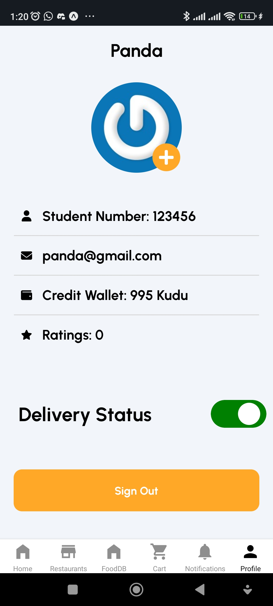
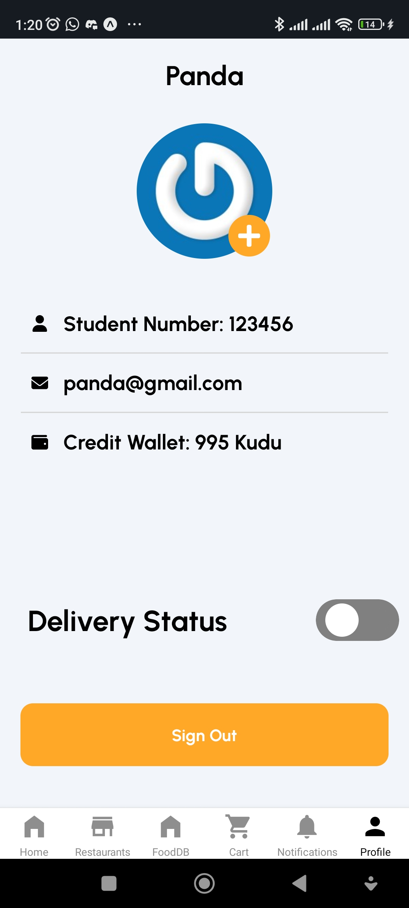
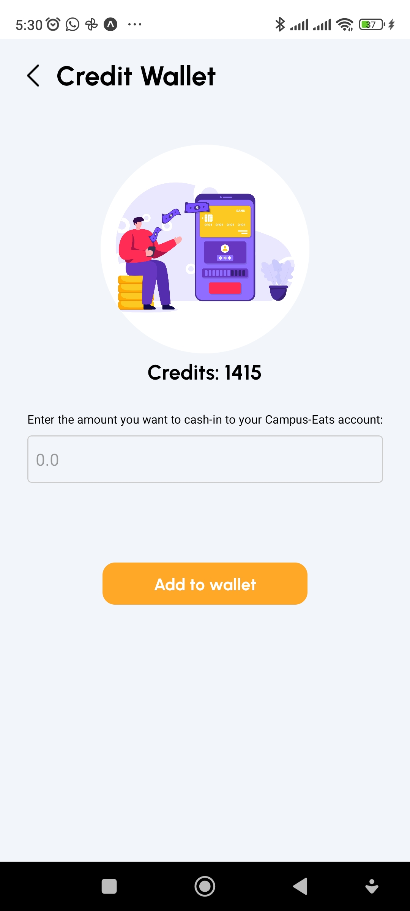
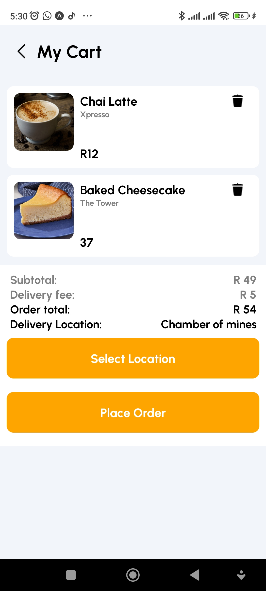
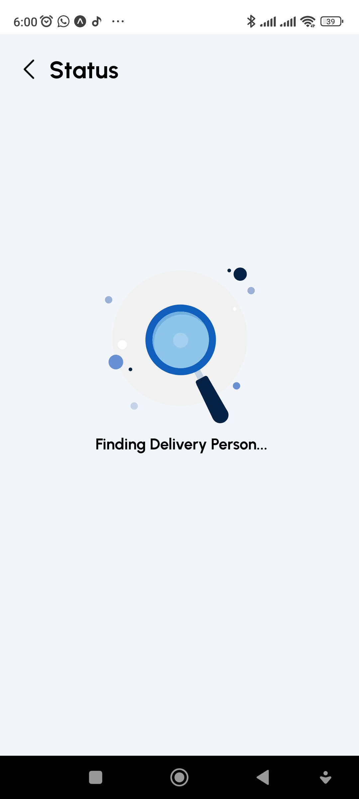
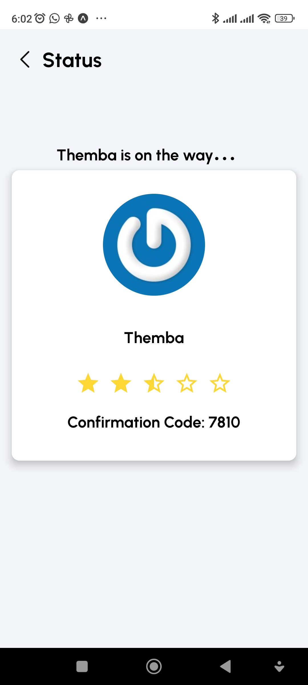
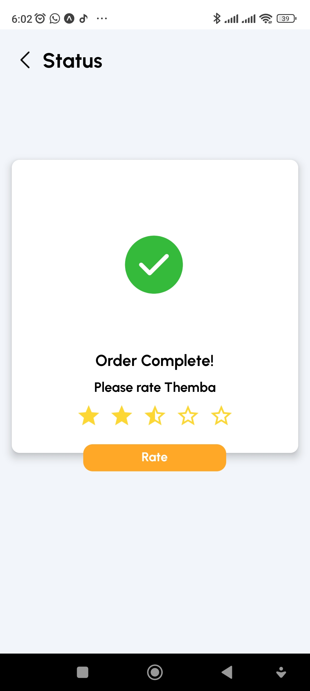
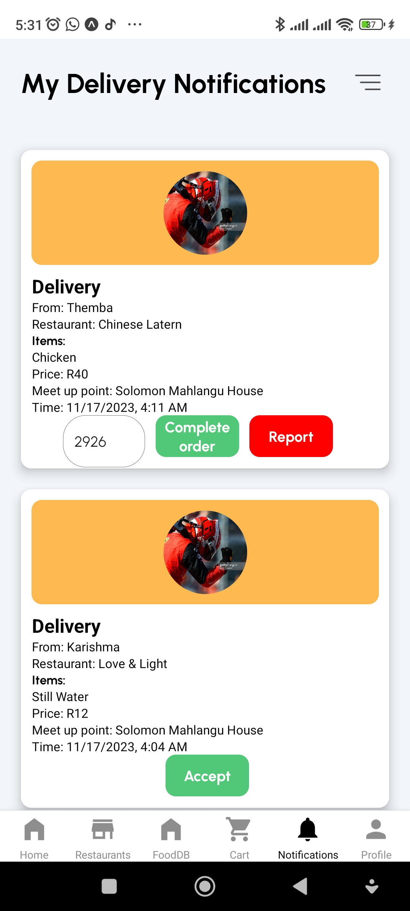

# CampusEats

CampusEats is a delivery app designed for the Wits University campus, providing a convenient and efficient way for users to order food and for delivery personnel to fulfill those orders.

## Table of Contents

- [Introduction](#introduction)
- [Features](#features)
- [Built With](#built-with)
- [Getting Started](#getting-started)
  - [Prerequisites](#prerequisites)
  - [Installation](#installation)
- [Quick Start Video](#Quick-Start-Video)
- [Usage](#usage)
  - [User Registration and Login](#user-registration-and-login)
  - [Changing User Status](#changing-user-status)
  - [Adding Credits](#adding-credits)
  - [Placing Orders](#placing-orders)
  - [Order Tracking](#order-tracking)
  - [Driver Notifications](#driver-notifications)
  - [Managing Favorites](#managing-favorites)

## Introduction

CampusEats is a delivery app that streamlines the process of ordering and delivering food within the Wits University campus. Users can register, log in, and switch between user and delivery person roles. The app utilizes Kudu credits for transactions and offers real-time order tracking. Drivers receive notifications for incoming orders, which they can accept or reject.

## Features

- User registration and login
- Switching between user and delivery person roles
- Kudu credit management for placing orders
- Real-time order tracking with three status updates: "Finding Delivery Person," "Order Accepted," and "Order Completed"
- Driver notifications for incoming orders
- Food listing in various categories
- Adding food items to favorites

## Built With

 

CampusEats is built with Firebase for backend services and React Native for the cross-platform mobile application.

## Getting Started

### Prerequisites

- expo

### Installation

1. Clone the repository: `git clone  https://github.com/CODESHEDDING-EATS/Campus-Eats.git`
2. Navigate to the project directory: `cd CampusEats`
3. Install dependencies: `npm install --force`

## Quick Start Video

### Customers Perspective

https://github.com/CODESHEDDING-EATS/Campus-Eats/assets/65980113/af99be7c-3cfe-4ca0-8347-43dba5c043b9

### Derivery Person's Perspective

https://github.com/CODESHEDDING-EATS/Campus-Eats/assets/65980113/795905f4-6f0a-4e2c-9507-1c38b0a8d7ee

## Usage

### User Registration and Login

Open the app and click on the "Sign Up" button.
Fill in the required details and click "Register."
If already a user, click on "Log In" and enter your credentials.

### Changing User Status

Navigate to the user profile.
Select "Change Role" to switch between user and delivery person roles.

   
  

### Adding Credits

Go to the wallet or credits section.
Add Kudu credits to your account.

### Placing Orders

Browse food categories on the home page.
Select desired items and click "Place Order."
Confirm order details and proceed to checkout.

### Order Tracking

View order status updates in real-time.
Three order statuses: "Finding Delivery Person," "Order Accepted," and "Order Completed."

   
  
  

### Driver Notifications
Drivers receive notifications for new orders.
Accept or reject orders.

